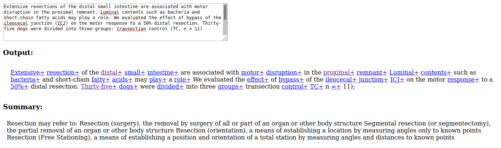

Rudimentary prototype for matching summaries of professional jargon to a dense scientific paper.
Parses keywords, then searches and provides the wikipedia summary.

In the future I might have to create or find a list of professional jargon (and explanation) to improve efficiency and quality.

how to use:    
`npm start`    
`firefox ./dist/index.html` (replace firefox with your browser)    
Then paste whatever text in the textarea, PRESS ENTER and wait.    

preview:     

learned/reinforced:
 - working with strings, regex
 - webpack and babel setup
 - wikijs
 - keyword-extractor
 - prototyping